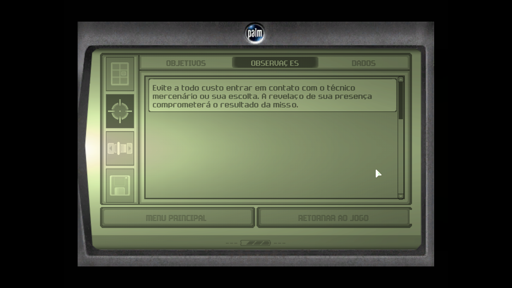
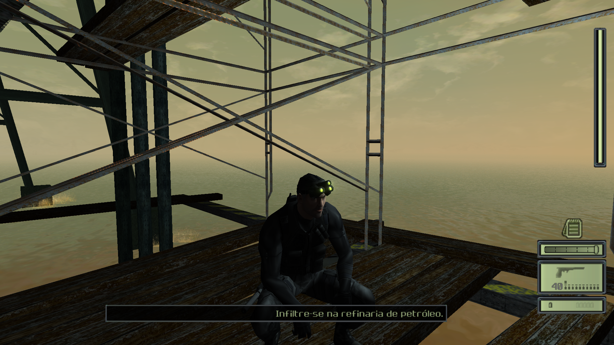

# Tradução PT-BR Splinter Cell 2003 Corrigida

Tradução GameVicio.

**Corrigida em 2023 por João Paulo Carvalho**.

### Links interessantes

- [Download da tradução original](https://www.gamevicio.com/traducao/traducao-de-tom-clancy-s-splinter-cell-para-portugues-brasil/)
- [Comprar o jogo na Steam](https://store.steampowered.com/app/13560/Tom_Clancys_Splinter_Cell/)

## Por que esta tradução?

Os arquivos originais baixados pelo site da GameVicio **não funcionam**, após a intalação concluída.

A razão pra isto, é devido ao nome dos arquivos exportados. Deveriam ser exportados com extensão `.int`, mas são exportados com `.bra`. Mas não se preocupe, os arquivos dentro da pasta `system` já estão corrigidos.

### Como instalar

> Esta tradução foi testada na versão [Steam](https://store.steampowered.com/app/13560/Tom_Clancys_Splinter_Cell/). Não garanto que possa funcionar em outras versões.

- Recomendo fazer um backup dos arquivos originais do jogo antes da instalação (se você usar a versão Steam é dispensável).
- Extraia a pasta `system` na raiz da instalação do jogo (por exemplo `steamapps\common\Splinter Cell`).
- Abra o jogo e aproveite! ;)

### Bugs conhecidos

- Caracteres assinados com til (`~`) não são exibidos corretamente.

## Screenshots

